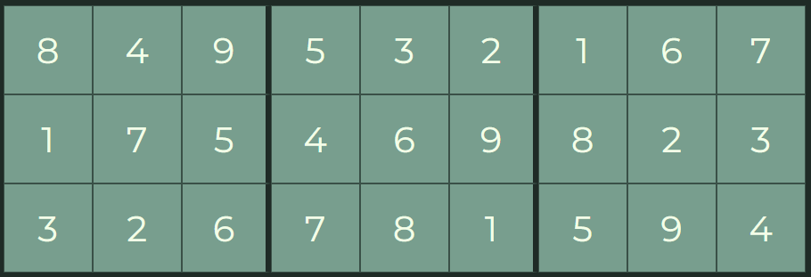

    
  
  <h1>
    SudokuSolver - a NYT Puzzle solver
     
  </h1>      

  

    A sudoku solver for the daily NYT Sudoku Puzzles. Scrapes the NYT for all 3 difficulties every day.
     
  

  

   <strong>CSS</strong>&nbsp;  &nbsp; &nbsp; <strong>Vanilla</strong> &nbsp;  &nbsp; &nbsp;  <strong>NodeJS</strong> &nbsp;  &nbsp; &nbsp; 
  

   
  

      
    
    
  

 
  
   

 

- [Installation](#installation)
  - [Requirements](#requirements)
  - [Steps](#steps)
- [Features](#features)
- [Upcoming Features](#upcoming-features)
- [FAQ](#faq)
  - [I mostly like what you've done, but I want to tweak a few things. Can I fork this and use it myself?](#i-mostly-like-what-youve-done-but-i-want-to-tweak-a-few-things-can-i-fork-this-and-use-it-myself)

## Installation

### Requirements

- A server or place to host serverless functions to fetch the puzzles from the New York Times website and deliver them to the client.
- A place to host the front-end
 
### Steps

1) Fill out the `.env-sample` with all the relevant data, rename it to `.env` and run the server. There is also an included docker package if you prefer to containerize it.

2) Run the static files on your host.

3) You will need to change the API url in the client to point towards your server.

4) Never hand solve a sudoku again!
   
## Features

- Allows you to change the time between computer moves so you can watch every decision.

## Upcoming Features

- More complicated algorithms - such as verifying row/column/subgrids before making moves. This should reduce the amount of backtracking the computer makes.

## FAQ

### I mostly like what you've done, but I want to tweak a few things. Can I fork this and use it myself?

> Of course you can! I initially made this tool primarily for myself, but have released it to the wild to help anyone. Take it, change it, morph it and squash it to your heart's desire. 
